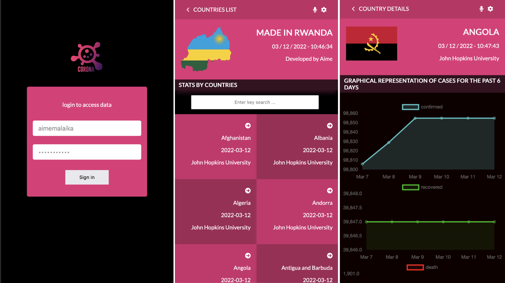

# Metrics WebApp
> This React capstone project (remember what are they?)is about building a mobile web application to check a list of metrics (numeric values) that you will create making use of React and Redux.

## Live Preview
- > [Web App Link](https://aime-metric-app.netlify.app/)
- > [Live demo](https://www.loom.com/share/31d5d2b28836426bb648c19d5f02f8e6)
## Built With
- HTML & CSS & JavaScript
- Html, Css & JavaScript linters
- React.Js and Redux

##### Getting Started
- clone the repository by running\
    `git clone https://github.com/aimemalaika/metrics-webapp.git`
- navigate to the folder\
    `cd metrics-webapp`
- Install packages\
    `npm install`
- Run the app\
    `npm start`
- Eject the app\
    `npm run eject`
- Create build app\
    `npm run build`
- Test Linters app\
    `npm run check-linters`
## Authors 

👤 **Aime Malaika**
- GitHub: [@aimemalaika](https://github.com/aimemalaika)
- Twitter: [@aimemalaika](https://twitter.com/Aime_Malaika)
- LinkedIn: [@aimemalaika](https://linkedin.com/in/aimemalaika)

## Acknowledgments

- Original design idea by [Nelson Sakwa on Behance](https://www.behance.net/sakwadesignstudio)
## :handshake: Contributing
Contributions, issues, and feature requests are welcome!
## Show your support
Give a :star:️ if you like this project!
## :memo: License
This project is [MIT](./MIT.md) licensed.